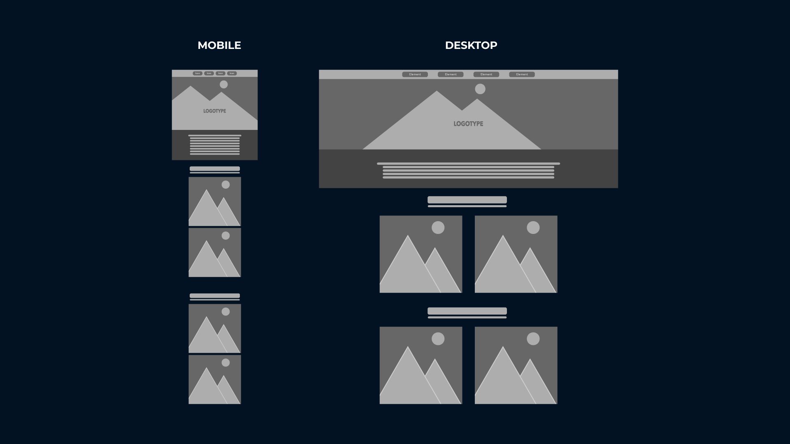

# EmploymentSector Site

### PROJECT OVERVIEW

Due to the collapse of the economy brought upon by the pandemic, initial data gathered shows lack of workforce in various sectors. Thus, rebuilding and strengthening employment is paramount, and is now needed more than ever. 

The Employment Sector project aims to provide in-depth information about the employment count of Singapore. It can cater to the government as well as the job hunters. It would be beneficial for the government as its main goal is to organize the updated data to aid manpower allocation. Moreover, the job hunters could take advantage of this, as the application has its potential to be a job portal in the future. 

Given that data organization is its backbone, it would provide the user a systematized flow of information. Hence, giving them an opportunity to make better decisions for future endeavors.

### UI/UX

#### User Stories

US01. As a user, I want to be able to navigate easily throughout the application.
US02. As a user, I want to see which employment sectors are lacking and which are well maintained.
US01. As a user, I want to be able to see the workforce count history of each employment sector  through the years. 
US01. As a user, I want to compare each sector with the others.

#### Wireframe

Wireframes for both mobile and desktop verson can be found 

#### 5 Planes of UI/UX

1. Strategy
    - Site/app exists to serve employers or employees essential and numeric data on the different employment sectors.  
2. Scope
    - The site gives off the # of employees for each sector in the selected year.
    - User can select a year span to show the data comparison of each sector.
3. Structure
    - The site contain data from 1991 up to 2020.
    - The Goods Producing Industries are divided into 3 catrgories which you can toggle on and off to narrow down the info you need on the screen.
    - The Sercices Producing Industries are divided into 7 Categories which you can toggle on and off to narrow down the info you need on the screen.
4. Skeleton
    - Elements are organized in a one pager website format.
    - Designed with a Sticky nav on top.
    - Header banner contains the logo for the 1st section.
    - About Us will contain text information on the site, this will form the second section.
    - Goods Producing will contain charts following the Goods sectors to form the fourth section.
    - Services producing contains charts following the Sevices Sector to forn the last section.
    - Easy flow on information as users/viewrs will follow our normal process of reading info of left to right and top to bottom.
5. Surface
    - Fonts will take the Sans serif route to give of a formal and modern look to it
    - Blue color motif to give of the professional feeling to the user, monochrome blue was used to inddicate the info in the apex charts.
    - Styled it bt a one pager with a smooth scrolling effect animation for better interaction with the user.
    - Easy access to each section due to the sticky nav inclusion.

### FEATURES

 The sites’ main feature is the interactive charts where the user can see the different numeric data of the different sectors featured.
 The side by side charts also feature its synchronous nature where in the event of a hover action, the indicator from where you are pointing the cursor, the partner chart will follow its location.
 Additionally, It also features a drop down where you can select different time frames and project data from the selected one.

 With regards to pending implementation, the site has potential to be a job portal, with this site being the intro page for it. User can be educated to the current status of the employment industries and will be able to help them make a more informed decisions regarding their carreer path or future choices

 For the bugs and limitations, I find that I always need to refresh the page to get it to work properly, resizing the window from a larger size to a smaller one, and vice versa.

### TECHNOLOGIES USED

* HTML
   * To house site content

* CSS
   * Run smooth scroll animation custom elements of the site

* Javascript
   * Used mainly for the functions of the apex map, to filter and map the information.

### TEST CASES

|Category |Input/Actions | Output/Errors |
|---------|-----------------------------|---------------------|
|Overall | Mobile Responsive Check| Charts does not fully adjust to the smallest screen size(mobile) |
|Chart Fucntion| On load | Displays sectors. Color is monochrome to match the motif of site|
| | Clicking on colored icon legend | Will toggle on and off the data of the chosen sector|
| | Hovering accross the chart| Will show the legend and numeric value. Partner chart will mimic the position hovered. |
| | Selecting year span from dropdown | Will select data from specific year span |
|Nav Bar| Hover | will highlight button |
| | On press | Page will scroll down to button selection - section |
| | On load | Sticks to the top |
| | Responsive | Will hide text on mobile size but retain icons |

### PLATFORM USED

* Github for CI/CD
* Access live [Web Application](https://github.com/dcabangon/EmploymentSectorGuide) via Github
* To deploy my project to your local machine
   1. Go to [https://github.com/dcabangon/EmploymentSectorGuide](https://dcabangon.github.io/EmploymentSectorGuide/)
   2. Download my project repository
     > `gh repo clone dcabangon/EmploymentSectorGuide`

* Dependencies used
   * Apexcharts
      * To house the main content of the site

   * Google fonts, Fontawesome and Getty
      * These were used to improve the design of the site

### CREDITS
* Employment Statistics
   * [singstat.gov.sg](https://www.tablebuilder.singstat.gov.sg/publicfacing/createDataTable.action?refId=15659)
* Header Image 
   * [Getty](www.gettyimages.com)
* Icons
   * [Fontawesome](https://fontawesome.com)
* Fonts
   * [GoogleFonts](https://fonts.google.com)
* Code Snippets
   * [SmoothScroll](https://www.w3schools.com/howto/howto_css_smooth_scroll.asp)
